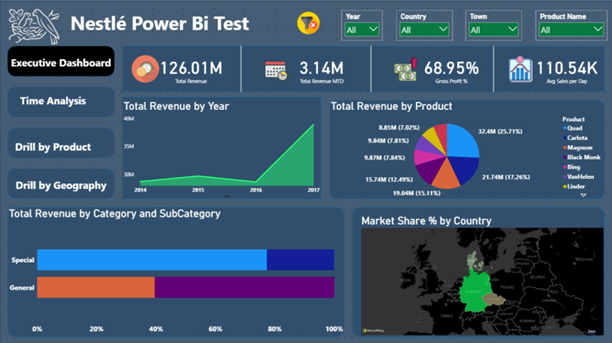
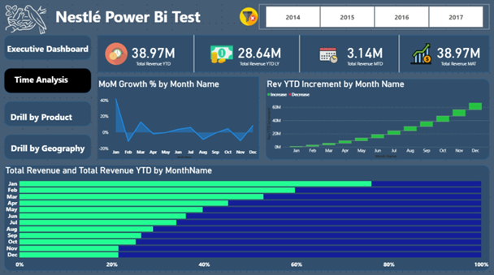
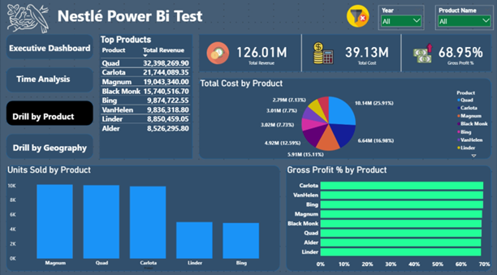
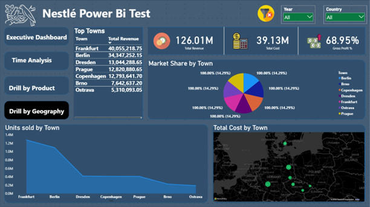

# 📊 Sales Analytics System – Power BI (Nestlé Technical Assessment)

A scalable, parameter-driven analytics solution built using **Power BI**, designed to transform raw multi-year sales data into a structured model and executive-ready insights — all under strict time constraints.

---

## 🚨 The Challenge

The task was to build a complete analytics solution from raw files within **120 minutes**, while handling:

- Multiple data sources (Sales + Dimensions)  
- Inconsistent formats (dates, IDs)  
- Power BI limitations (privacy levels, file paths)  
- Requirements for scalability and portability  

👉 The goal was not just visualization — but building a **robust, reusable BI system**

---

## 💡 The Approach

Instead of building a static dashboard, the solution was designed as a **scalable data pipeline within Power BI**:

- Dynamic ingestion of all sales files  
- Parameterized architecture for portability  
- Clean star schema model  
- Reusable transformation logic  
- Business-oriented dashboard design  

---

## ⚙️ System Overview

The system processes data end-to-end:

1. Loads all sales and dimension data dynamically  
2. Cleans and standardizes inconsistent fields  
3. Builds a structured star schema  
4. Applies DAX measures for business metrics  
5. Presents insights across multiple analytical views  

---

## 🧠 Key Capabilities

🔄 <strong>Dynamic Data Ingestion</strong> 
Automatically loads all files from folders. New data is picked up without modifying queries.

  

⚙️ <strong>Parameterized Architecture</strong> 
Portable across machines using dynamic folder paths instead of hardcoded locations.

  

🧱 <strong>Star Schema Modeling</strong> 
Optimized data model for performance, scalability, and clarity.

  

🧩 <strong>Reusable Data Transformation</strong> 
Custom Power Query function standardizes inconsistent ID formats.

  

📊 <strong>Advanced Time Intelligence</strong> 
YTD, MTD, MAT, and growth metrics powered by a dedicated calendar table.

---

## 📊 Dashboard Views

The report is structured into four analytical layers:

- **Executive Overview** → KPIs and high-level performance  
- **Time Analysis** → trends, growth, and seasonality  
- **Product Analysis** → profitability and demand  
- **Geography Analysis** → regional performance and market share  

---

## 📸 Dashboard Preview

### 🧭 Executive Overview

### ⏱️ Time Analysis

### 📦 Product Analysis

### 🌍 Geography Analysis

---

## 🏗️ Data Architecture

The solution follows a **star schema design**:

- **Fact Table** → Sales  
- **Dimension Tables** → Product, Geography, SalesRep, SubCategories, Categories, Calendar  

This structure enables efficient filtering and scalable analytics.

---

## ⚙️ How to Use

1. Download and unzip the repository  

2. Open `Preview.pbix`  

3. Go to:
   File → Options and Settings → Options → Global → Privacy  

   Enable:
   Always Ignore Privacy Settings  

4. Open:
   `sales-analytics-template.pbit`

5. Provide parameters:
   - SalesFolder → path to `/data/sales`  
   - DimensionsFolder → path to `/data/dimensions`  

⚠️ Do NOT include quotation marks  

6. Click **Load**

---

## ⚠️ Key Challenges

- Power BI privacy restrictions when combining multiple sources  
- Date parsing inconsistencies across files  
- Designing dynamic ingestion within strict time constraints  

---

## 💡 Key Design Decisions

- Parameterization to ensure portability  
- Star schema to improve performance and clarity  
- Reusable transformations to standardize messy data  

---

## 🔄 Future Improvements

- Incremental refresh for large datasets  
- Additional drill-through analysis  
- Forecasting and advanced KPIs  

---

## 📎 Documentation

- docs/instructions.md → assessment requirements  
- docs/implementation.md → technical approach  
- docs/nestle-powerbi-assessment.pdf → original instructions  

---

## 🎥 Demo

Available in:
media/demo.mp4

---

## 🧠 Why This Project Stands Out

This is not just a Power BI dashboard.

It demonstrates:

- 🧠 System design thinking under time constraints  
- ⚙️ Real-world data engineering within BI tools  
- 📊 Business-oriented analytics design  
- 🔄 Scalable and reusable architecture  
- 🚀 Ability to deliver under pressure (120 minutes)  

---

## 🧑‍💻 Author

**Adham Elkhouly**

- Data Analyst @ Nestlé  
- Focused on Power Platform, BI systems, and scalable data solutions  